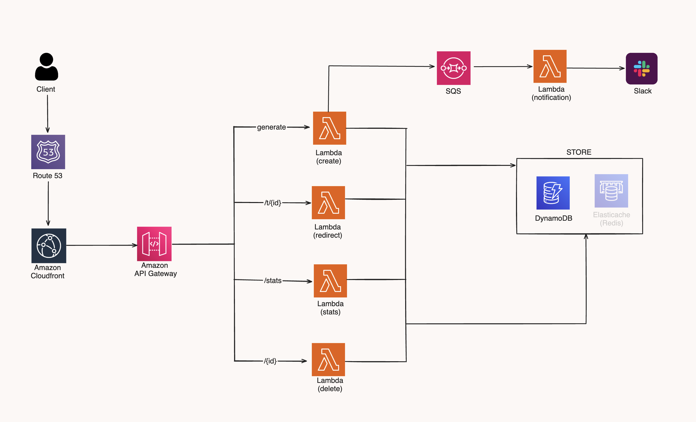
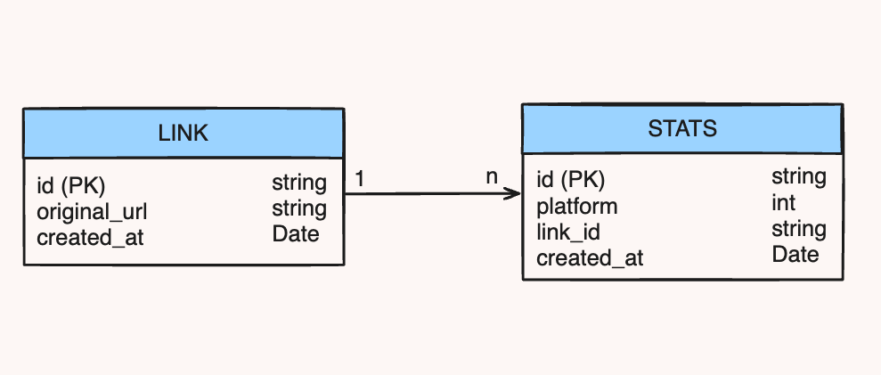

# Go URL Shortener


This URL shortener service, built with Go and employing Hexagonal Architecture, adopts a serverless approach for scalable and high-performing operations. It harnesses various AWS services to deliver a resilient, maintainable, and highly accessible URL shortening service.

- [Go URL Shortener](#go-url-shortener)
  - [Functional Requirements](#functional-requirements)
  - [Non-Functional Requirements](#non-functional-requirements)
  - [Features](#features)
  - [Prerequisites](#prerequisites)
  - [Technologies Used](#technologies-used)
  - [System Architecture](#system-architecture)
  - [Class Diagram](#class-diagram)
  - [Installation](#installation)
    - [Clone the Repository](#clone-the-repository)
  - [Build the Project](#build-the-project)
    - [Usage](#usage)
  - [Deploying to AWS Lambda](#deploying-to-aws-lambda)

## Functional Requirements

- **Shortening URLs**: Users should be able to input a URL and receive a shortened version.
- **URL Redirection**: When accessing a shortened URL, users should be redirected to the original URL.
- **Analytics**: Provide analytics for each shortened URL, including click counts and basic usage stats.
- **API Access**: Offer API endpoints for creating, retrieving, and managing shortened URLs.
- **User Notifications**: Send notifications for specific actions like URL creation or deletion (Slack).

## Non-Functional Requirements

- **Scalability**: The system must automatically scale to handle varying loads.
- **Performance**: High performance in URL redirection and shortening operations.
- **Reliability**: Ensure high availability and fault tolerance.
- **Security**: Implement security measures to prevent unauthorized access and abuse.
- **Maintainability**: Code should be well-organized, documented, and adhering to Hexagonal Architecture principles for easy maintenance.
- **Monitoring and Logging**: Implement comprehensive monitoring and logging for troubleshooting and performance tracking.

## Features

- **URL Generation**: Create shortened URLs efficiently.
- **Redirection**: Redirect users to original URLs via shortened links.
- **Stats**: Gather and display usage stats of shortened URLs.
- **Notification**: Notify users or systems of certain actions or events.
- **Deletion**: Safely remove shortened URLs and their associated data.

## Prerequisites

- Go (Golang) installed on your system.
- AWS SAM CLI for deploying serverless functions.
- Access to AWS Lambda and related AWS services.

## Technologies Used

- **Go (Golang)**: The primary programming language used for development.
- **AWS DynamoDB**: A NoSQL database service used for storing and retrieving data efficiently.
- **ElastiCache(Redis)**: An in-memory data structure store, used as a cache and message broker.
- **AWS CloudFormation**: A service for defining and deploying infrastructure as code, ensuring consistent and repeatable architectural deployments.
- **AWS SQS (Simple Queue Service)**: A message queuing service used to decouple and scale microservices, distributed systems, and serverless applications.
- **GitHub Actions**: Automated CI/CD platform used for building, testing, and deploying code directly from GitHub repositories.
- **AWS Lambda**: A serverless compute service that lets you run code without provisioning or managing servers, automatically scaling with usage.
- **AWS CloudFront**: A fast content delivery network (CDN) service that securely delivers data, videos, applications, and APIs to customers globally with low latency and high transfer speeds.
- **AWS API Gateway**: A fully managed service that makes it easy for developers to create, publish, maintain, monitor, and secure APIs at any scale.

## System Architecture



## Class Diagram



## Installation

### Clone the Repository

```bash
git clone https://github.com/Furkan-Gulsen/golang-url-shortener.git
cd golang-url-shortener


## Build the Project
```bash
make build

### Usage
## Deploying to AWS Lambda
```bash
make deploy

This command will use AWS SAM to deploy your serverless functions.

Running Tests
Unit Tests
```bash
make unit-test

Benchmark Tests
```bash
make benchmark-test

Cleaning Up
Clean Build Artifacts
```bash
make clean

Delete Deployed Stack
```bash
make delete